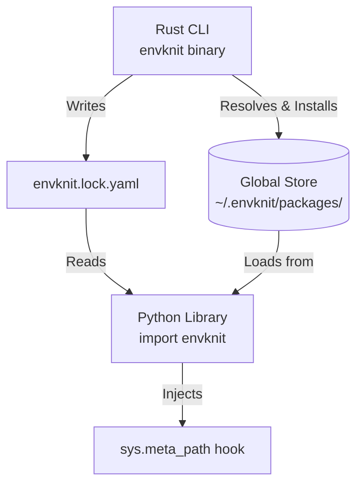

# How EnvKnit Works

## Architecture: Global Store vs Virtual Environments

Unlike traditional virtual environments (`venv`) that copy/install packages redundantly per project, EnvKnit uses a global package store. This architectural choice is what unlocks multi-version coexistence.

```mermaid
graph TD
    subaxis1(Traditional Virtual Environments)
    subgraph "Project A (.venv/)"
        A1[requests 2.28]
        A2[pytest 7.4]
    end
    subgraph "Project B (.venv/)"
        B1[requests 2.31]
        B2[pytest 7.4]
    end
    
    subaxis2(EnvKnit Architecture)
    subgraph "Global Package Store (~/.envknit/packages/)"
        S1[requests/2.28.2/]
        S2[requests/2.31.0/]
        S3[pytest/7.4.3/]
    end
    
    P1(Project A) -. envknit.lock.yaml .-> S1
    P1(Project A) -. envknit.lock.yaml .-> S3
    
    P2(Project B) -. envknit.lock.yaml .-> S2
    P2(Project B) -. envknit.lock.yaml .-> S3
```

## Two Components, One Lock File

EnvKnit is split into two independent components that communicate exclusively through `envknit.lock.yaml` and the shared package store:



The CLI is a standalone Rust binary. It has no Python dependency. The Python library has no knowledge of how packages were resolved — it only consumes what the lock file declares and what the store contains.

---

## The Package Store (`~/.envknit/packages/`)

### Store Layout

```
~/.envknit/packages/
  requests/
    2.28.2/
      requests/           ← importable package directory
      requests-2.28.2.dist-info/
    2.31.0/
      requests/
      requests-2.31.0.dist-info/
  pytest/
    7.4.3/
      pytest/
      _pytest/
      pytest-7.4.3.dist-info/
  numpy/
    1.26.4/
      numpy/
      numpy-1.26.4.dist-info/
```

Each version lives in its own isolated directory:
`~/.envknit/packages/<name_lowercase>/<version>/`

The CLI installs into these directories using `pip install --target <path>`. Multiple
versions of the same package coexist without conflict because each gets its own directory.

### Why Not Virtual Environments?

Virtual environments solve the "wrong Python / wrong system packages" problem but not
multi-version coexistence. With venvs:

- Each project gets one version of each package.
- Switching versions requires recreating the environment.
- Multiple versions in the same process are impossible.

EnvKnit's store lets different parts of an application use different versions of the
same package simultaneously — critical for migration scenarios and compatibility testing.

### The `bin/` Script Limitation

> **WARNING: `pip install --target` does NOT create `bin/` entry points.**

When `pip install --target <dir>` is used, pip writes the package files (`.py` modules,
`.so` extension files, metadata) into the target directory. It does **not** create
executable entry points (the `scripts/` or `bin/` wrappers that pip normally places into
a venv's `bin/` directory).

This means that tools like `pytest`, `black`, `mypy`, and `ruff` are installed into the
store, but their executables are **not** on `PATH`.

```
envknit run -- pytest           # FAILS: command not found
envknit run -- python -m pytest # WORKS: -m searches PYTHONPATH
```

The `-m` flag instructs Python to search `sys.path` (which includes `PYTHONPATH`) for a
module named `pytest` and execute its `__main__`. Since `envknit run` injects
`PYTHONPATH` with all install paths, `-m` finds the installed package correctly.

See [Running CLI Tools](cli-scripts.md) for a complete list of tool invocations.

---

## PYTHONPATH Injection

### How `envknit run` Sets Up the Environment

When you run `envknit run -- <command>`, the CLI:

1. Reads `envknit.lock.yaml` from the nearest parent directory.
2. Collects `install_path` from each `LockedPackage` in the requested environment.
3. Filters out dev packages if `--no-dev` is passed.
4. Joins the paths with `:` and prepends them to the existing `PYTHONPATH`.
5. Resolves Python and Node.js binaries if `python_version` / `node_version` are set.
6. Spawns the command with the modified environment.

```
PYTHONPATH = <pkg1_path>:<pkg2_path>:<pkg3_path>:$PYTHONPATH
```

The subprocess inherits this `PYTHONPATH`. Standard Python import resolution searches
`PYTHONPATH` directories before system site-packages, so installed packages are
found first.

### Environment Variables Reference

| Variable | Set when | Value |
|---|---|---|
| `PYTHONPATH` | Always | Install paths joined with `:`, prepended to existing value |
| `PYTHON` | `python_version` is set in config | Absolute path to resolved Python binary |
| `PYTHON3` | `python_version` is set in config | Same as `PYTHON` |
| `PATH` | `node_version` is set in config | Node bin dir prepended to existing `PATH` |
| `ENVKNIT_ENV` | Always | Name of the active environment (e.g., `"default"`) |

---

## The Lock File as Contract

The lock file is an immutable contract between the CLI and the Python library. Neither
component talks to the network or to pip at runtime — they only read from what was
pre-installed.

- CLI writes `envknit.lock.yaml` during `envknit lock`.
- CLI populates `~/.envknit/packages/` during `envknit install`.
- Python library reads `envknit.lock.yaml` during `configure_from_lock()`.
- Python library reads `~/.envknit/packages/<name>/<version>/` to load modules.

If the lock file says `requests==2.31.0` with
`install_path=/home/user/.envknit/packages/requests/2.31.0/`, the Python library adds
that path to `sys.path`. No network access. No re-resolution.

---

## Import Hook (Python Library)

### `sys.meta_path` Interception

When `envknit.enable()` or `envknit.configure_from_lock()` is called, a custom
`MetaPathFinder` is prepended to `sys.meta_path`. Python consults finders in order for
every `import` statement.

The EnvKnit finder:

1. Checks whether the requested module name matches a registered package.
2. If a version override is active in the current context (`_active_versions`), routes
   the import to the versioned install directory.
3. Returns a `ModuleSpec` pointing to the file in `~/.envknit/packages/<name>/<version>/`.
4. Falls through to the next finder in `sys.meta_path` if no match is found.

This is transparent: code like `import requests` continues to work without changes. The
hook silently redirects to the correct version.

### ContextVar-Based Version Routing

Version routing is per-task and per-thread, not global. Two ContextVars carry the state:

- `_active_versions`: maps normalized package name to version string for the current
  asyncio Task or thread. Default: `{}` (no overrides — use configured defaults).
- `_ctx_modules`: module cache for the current context. Default: `None` (no override
  active).

When `envknit.use("requests", "2.31.0")` is entered as a context manager:

1. A new dict is created and stored in `_active_versions` for the current context.
2. A fresh module cache dict is stored in `_ctx_modules`.
3. Imports within the block resolve against the new version.
4. On exit, the ContextVar tokens are reset — other tasks are unaffected.

Because `ContextVar` values are inherited by child tasks but not shared with sibling
tasks, each `asyncio.Task` gets an independent copy of the version mapping. Multiple
concurrent tasks can use different versions of the same package simultaneously.

### Pure-Python vs C Extension Packages

The import hook handles only **pure-Python** packages. For packages that contain C
extensions (`.so` / `.pyd` files), in-process multi-version loading is impossible
because:

- C extension initialization functions (`PyInit_<name>`) are registered globally.
- A second `import` of a different version of the same C extension in the same process
  returns the already-initialized module.
- Unloading C extensions is not supported in CPython.

Detection: the hook scans install directories for files matching Python's
`EXTENSION_SUFFIXES` (e.g., `.cpython-311-x86_64-linux-gnu.so`). If found, a
`CExtensionError` is raised when `envknit.use()` is called for that package.

Use `envknit.worker()` for C extension packages. See [Python API Guide](python-api.md).

---

## Known Limitations & The Road Ahead

EnvKnit's "In-process multi-version loading" (via `sys.meta_path` and `ContextVars`) provides unprecedented flexibility, but it fundamentally hacks Python's "one module per process" assumption. This creates several "Soft Isolation" limitations.

### 1. Type Checking and Object Compatibility
Classes are identified by memory addresses. A `Response` class loaded from `requests v1` and another from `requests v2` are treated as completely different types.
- **Symptom:** `isinstance(obj_from_v1, requests_v2.Response)` evaluates to `False`. This breaks frameworks relying on strict type checking (like Pydantic).
- **Workaround:** Rely on Duck Typing and structural subtyping (`typing.Protocol`) across version boundaries.

### 2. Global State and Singleton Contamination
While EnvKnit isolates the module routing, it **does not isolate Python's built-in objects**.
- **Symptom:** If two versions of a package modify `logging` handlers, mutate `sys.modules`, or register themselves in a global singleton (e.g., SQLAlchemy's `MetaData`), they will overwrite each other's state.

### 3. The Serialization (Pickle) Nightmare
Python's `pickle` stores the literal import path of a class alongside its data.
- **Symptom:** Serializing an object in a `v1` context and deserializing it in a `default` context leads to class mismatch errors.
- **Workaround:** Never use `pickle` across version boundaries. Convert objects to basic DTOs (JSON, dictionaries) before passing them.

### 4. C-Extension In-Process Loading
Packages with `.so` or `.pyd` files (NumPy, Pandas, etc.) are loaded by the OS dynamic linker (`dlopen`), making in-process multi-versioning impossible.
- **Workaround:** EnvKnit forces the use of `envknit.worker()` (subprocess isolation) for these packages, which introduces IPC serialization overhead.

---

## 🎯 Sweet Spots (When to use EnvKnit)
Given these limitations, EnvKnit is not a silver bullet for every project. It shines in:
1. **API Migrations:** Incrementally migrating hundreds of endpoints from an old SDK to a new one without splitting microservices.
2. **Plugin Systems:** Loading third-party plugins that require conflicting dependency versions.
3. **CLI / Utility Scripting:** Running conflicting dev tools or testing matrices side-by-side.

*Do not use in-process isolation for heavy data-science pipelines (NumPy/Pandas) or frameworks that heavily mutate global state.*

---

## 🚀 The Gen 2 Roadmap: Towards "Hard Isolation"
EnvKnit currently uses "Soft Isolation" (faking module caches). To solve the Global State and C-Extension problems permanently, the future roadmap targets **"Hard Isolation"**.

**The Plan: Python 3.12+ Sub-interpreters (PEP 684)**
By evolving the backend to leverage C-API level Per-Interpreter GILs, EnvKnit will be able to spawn true sub-interpreters instead of relying on `ContextVars`. 
- Each sub-interpreter will have its own strictly isolated `sys.modules`, `logging` state, and memory space.
- Combined with Multi-phase initialization (PEP 489), this will eventually allow C-Extensions to be loaded safely into the same process memory space without colliding.
